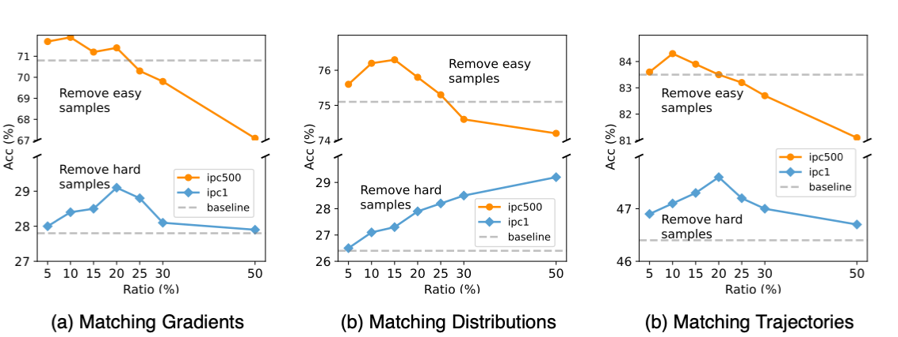
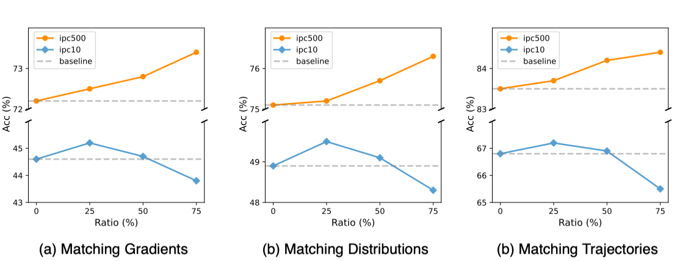

# Prioritize Alignment in Dataset Distillation


> **Prioritize Alignment in Dataset Distillation**
>
> Zekai Li, Ziyao Guo, Wangbo Zhao, Tianle Zhang, Zhi-Qi Cheng, Samir Khaki, Kaipeng Zhang, Ahmad Sajed, Konstantinos N Plataniotis, Kai Wang, Yang You
>
> National University of Singapore, Carnegie Mellon University, University of Toronto, Shanghai AI Laboratory

## Introduction

Matching-based Dataset Distillation methods can be summarized into two steps:

1. *Information Extraction*: an agent model is used to extract important information from the target dataset by recording various metrics such as gradients distributions, and training trajectories.
2. *Information Embedding*: the synthetic samples are optimized to incorporate the extracted information, which is achieved by minimizing the differences between the same metric calculated on the synthetic data and the one recorded in the previous step.

Previous matching-based Dataset Distillation methods introduce misaligned information, which is redundant and potentially detrimental to the quality of the synthetic data.


To address this, we prioritize alignment by filtering out misalignment information in both steps:

1. For *Information extraction*, we employ the data selection strategy to let different IPCs extract patterns from subsets of data with expected difficulty levels.
   
2. For *Information Embedding*, we mask out shallow-layer parameters during matching to avoid excessively injecting low-level information.
   

## Results

**PAD** is built on TM-based methods and achieve new SOTAs on several well-known benchmarks.


## Cross-Architecture

Distilled images by PAD generalize well on other model architectures


## Discussions

Effect of masking out shallow-layer parameters


Filtering misaligned information is also effective on matching gradients or distributions

1) Filtering *information extraction*:



2. Filtering *information embedding*:
   

   

## Getting Started

1. **Create environment as follows**
```bash
conda env create -f environment.yaml
conda activate distillation
```
2. **Generate expert trajectories**
```bash
cd buffer
python buffer_CL.py --dataset=CIFAR10 --model=ConvNet --train_epochs=100 --num_experts=100 --zca --buffer_path=../buffer_storage/ --data_path=../dataset/ --sort_method="CIFAR10_GraNd" --rho_max=0.01 --rho_min=0.01 --alpha=0.3 --lr_teacher=0.01 --mom=0. --batch_train=256 --init_ratio=0.75 --add_end_epoch=20 --rm_epoch_first=40 --rm_epoch_second=60 --rm_easy_ratio_first=0.1 --rm_easy_ratio_second=0.2
```
Hyper-parameters:

- `sort_method`: Data selection strategy. More can be found in https://github.com/PatrickZH/DeepCore.git
- `init_ratio`: Initial ratio of easy samples in the original dataset to start training
- `add_end_epoch`: The ending epoch for hard sample addition
- `rm_epoch_first`: The starting epoch of the first removing easy sample stage
- `rm_epoch_second`: The starting epoch of the second removing easy sample stage
- `rm_easy_ratio_first`: Ratio of easy samples removed in the first stage
- `rm_easy_ratio_second`: Ratio of easy samples removed in the second stage

3. **Perform the distillation**
   Filter parameters by depth:

   ```bash
   cd distill
   python PAD_depth.py --cfg ../configs/xxxx.yaml
   ```

   Filter parameters by loss:

   ```bash
   cd distill
   python PAD_loss.py --cfg ../configs/xxxx.yaml
   ```

## Evaluation
We provide a simple script for evaluating the distilled datasets.
```bash
cd distill
python evaluation.py --lr_dir=path_to_lr --data_dir=path_to_images --label_dir=path_to_labels --zca
```
## Acknowledgement
Our code is built upon [DATM](https://github.com/NUS-HPC-AI-Lab/DATM.git)
## Citation
If you find our code useful for your research, please cite our paper.
